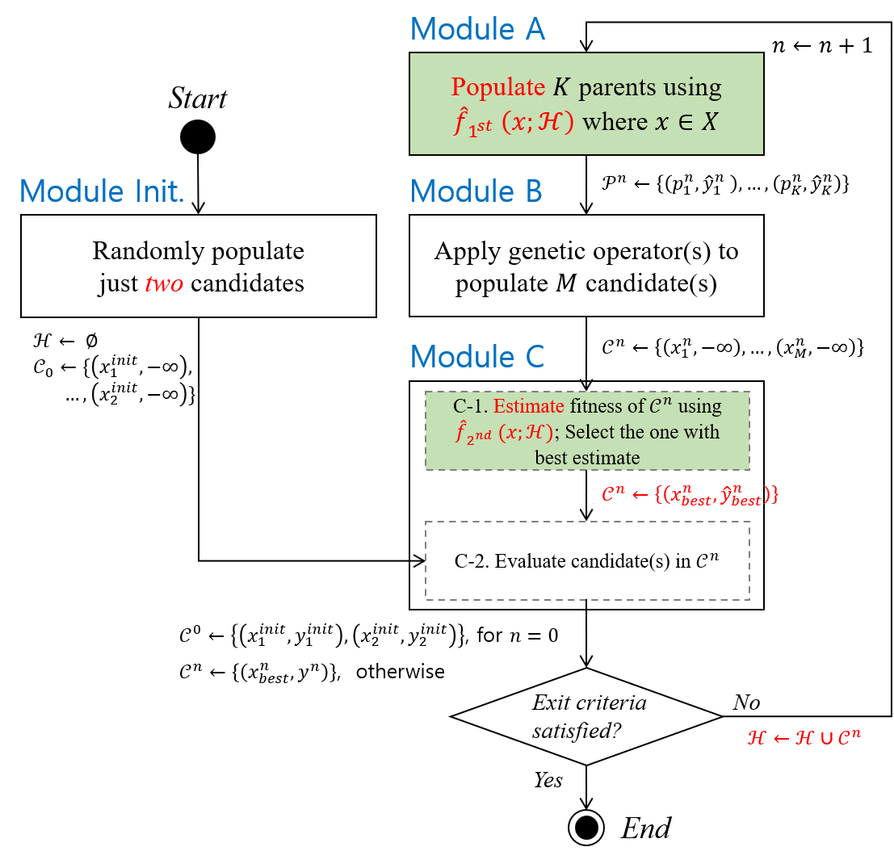

# B<sup>2</sup>EA: An Evolutionary Algorithm Assisted by Two Bayesian Optimization Modules for Neural Architecture Search

This is the offical implementation of the aforementioned paper.


-------

## Abstract


The early pioneering Neural Architecture Search (NAS) works were multi-trial methods applicable to any general search space. The subsequent works took advantage of the early findings and developed weight-sharing methods that assume a structured search space typically with pre-fixed hyperparameters. 
Despite the amazing computational efficiency of the weight-sharing NAS algorithms, it is becoming apparent that multi-trial NAS algorithms are also needed for identifying very high-performance architectures, especially when exploring a general search space. 
In this work, we carefully review the latest multi-trial NAS algorithms and identify the key strategies including Evolutionary Algorithm (EA), Bayesian Optimization (BO), diversification, input and output transformations, and lower fidelity estimation. To accommodate the key strategies into a single framework, we develop B<sup>2</sup>EA that is a surrogate assisted EA with two BO surrogate models and a mutation step in between. To show that B<sup>2</sup>EA is robust and efficient, we evaluate three performance metrics over 14 benchmarks with general and cell-based search spaces. Comparisons with state-of-the-art multi-trial algorithms reveal that B<sup>2</sup>EA is robust and efficient over the 14 benchmarks for three difficulty levels of target performance.


## Citation

To be updated soon

-------

## Requirements

### Prerequisite

This project is developed and tested on Linux OS. 
If you want to run on Windows, we strongly suggest using Linux Subsystem for Windows.
To avoid conflicting dependencies, we recommend to create a new virtual enviornment.
For this reason, installing [Anaconda](https://www.anaconda.com/download/) suitable to the OS system is pre-required to create the virtual environment.

### Package Installation

The following is creating an environment and also installing requried packages automatically using **conda**. 

```bash
(base) device:path/BBEA$ conda create -n bbea python=3.6
(base) device:path/BBEA$ conda activate bbea
(bbea) device:path/BBEA$ sh install.sh
```


### Tabular Dataset Installation

Pre-evaluated datasets enable to benchmark Hyper-Parameter Optimization(HPO) algorithm performance without hugh computational costs of DNN training.


#### HPO Benchmark

* To run algorithms on the HPO-bench dataset, download the database files as follows:

```
(bbea) device:path/BBEA$ cd lookup
(bbea) device:path/BBEA/lookup$ wget http://ml4aad.org/wp-content/uploads/2019/01/fcnet_tabular_benchmarks.tar.gz
(bbea) device:path/BBEA/lookup$ tar xf fcnet_tabular_benchmarks.tar.gz
```
Note that *.hdf5 files should be located under **/lookup/fcnet_tabular_benchmarks**.

#### Two NAS Benchmarks

* To run algorithms on the the NAS-bench-101 dataset, 
   * download the tfrecord file and save it into **/lookup**.
   * NAS-bench-101 API requires to install the CPU version of TensorFlow 1.12. 
```
(bbea)device:path/BBEA/lookup$ wget https://storage.googleapis.com/nasbench/nasbench_full.tfrecord

```


* To run algorithms on the NAS-bench-201, 
  * download **NAS-Bench-201-v1_1-096897.pth** file in the **/lookup** according to this [doc](https://github.com/D-X-Y/AutoDL-Projects/blob/master/docs/NAS-Bench-201.md). 
  * NAS-bench-201 API requires to install pytorch CPU version. Refer to [pytorch installation guide](https://pytorch.org/).
```
(bbea)device:path/BBEA$ conda install pytorch torchvision cpuonly -c pytorch
```

#### DNN Benchmark

* To run algorithms on the DNN benchmark, download the zip file from the [link](https://drive.google.com/file/d/1QMIVtm6pRQZuNrr82jtQxUVyb2Dou7Ec/view?usp=sharing).
  * Vaildate the file contains CSV files and JSON files in **/lookup** and **/hp_conf**, respectively.
  * Unzip the downloaded file and copy two directories into this project. Note the folders already exists in this project.


------

## HPO Run

### To run the B<sup>2</sup>EA algorithms 

The experiment using the proposed method of the paper can be performed using the following runner: 

* **bbea_runner.py**
  * This runner can conduct the experiment that the input arguments have configured.
  * Specifically, the hyperparameter space configuration and the maximum runtime are two mandatory arguments. In the default setting, the names of the search spaces configurations denote the names of JSON configuration files in **/hp_conf**. The runtime, on the other hand, can be set using seconds. For convenience, *'m'*, *'h'*, *'d'* can be postfixed to denote minutes, hours, and days.
  * Further detailed options such that the algorithm hyperparameters' setting and the run configuration such as repeated runs are optional. 
  * Refer to the help (-h) option as the command line argument.

```
usage: bbea_runner.py [-h] [-dm] [-bm BENCHMARK_MODE] [-nt NUM_TRIALS]
                      [-etr EARLY_TERM_RULE] [-hd HP_CONFIG_DIR]
                      hp_config exp_time

positional arguments:
  hp_config             Hyperparameter space configuration file name.
  exp_time              The maximum runtime when an HPO run expires.

optional arguments:
  -h, --help            show this help message and exit
  -dm, --debug_mode     Set debugging mode.
  -nt NUM_TRIALS, --num_trials NUM_TRIALS
                        The total number of repeated runs. The default setting
                        is "1".
  -etr EARLY_TERM_RULE, --early_term_rule EARLY_TERM_RULE
                        Early termination rule. A name of compound rule, such
                        as "PentaTercet" or "DecaTercet", can be used. The
                        default setting is DecaTercet.
  -hd HP_CONFIG_DIR, --hp_config_dir HP_CONFIG_DIR
                        Hyperparameter space configuration directory. The
                        default setting is "./hp_conf/"

```
------


## Results

Experimental results will be saved as JSON files under the **/results** directory.
While the JSON file is human-readable and easily interpretable, we further provide utility functions in the python scripts of the above directory, which can analyze the results and plot the figures shown in the paper.  

